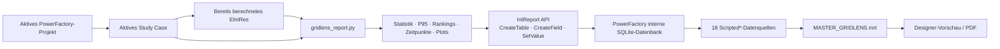
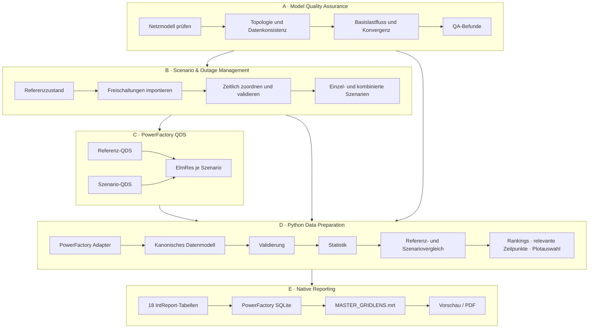
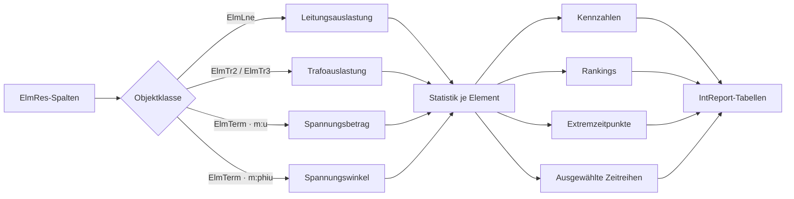
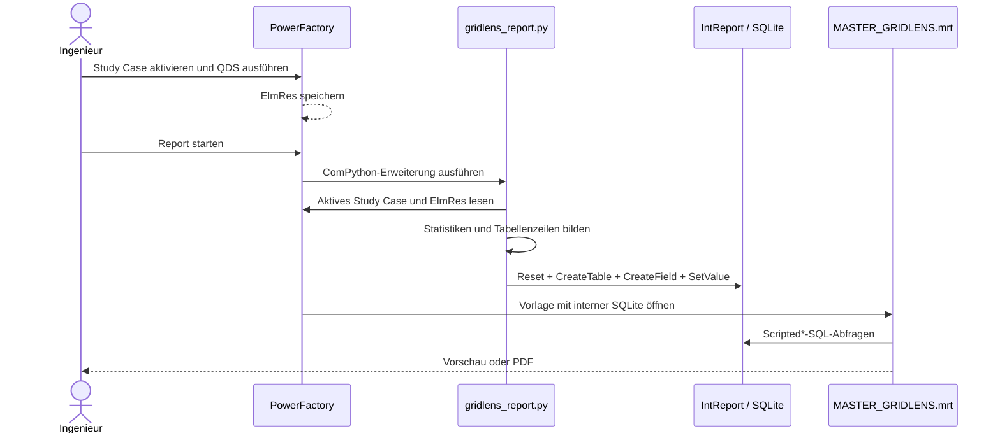

# GridLens – Big Picture

GridLens soll aus PowerFactory-Berechnungen einen wiederholbaren,
nachvollziehbaren Auto-Report erzeugen. PowerFactory bleibt dabei die Quelle für
Netzmodell, Szenarien, Berechnungen, Ergebnisse, Reporting-Datenbank und
PDF-Ausgabe. Python bereitet ausschließlich Daten für den Report Designer vor.
Die `.mrt` ist die direkt gepflegte Stimulsoft-XML-Vorlage.

## 1. Der heute direkt testbare Ablauf



Dieser Pfad ist im Repository implementiert. Das Skript:

- verwendet das aktive Study Case,
- sucht ein gefülltes `ElmRes`,
- liest Leitungen, Transformatoren und Knoten,
- liest standardmäßig `c:loading`/`m:loading`, `m:u`/`m:u1` und
  `m:phiu`/`m:phiu1`,
- berechnet Minimum, Maximum, Mittelwert, P95 und Extremzeitpunkte,
- erstellt Rankings und bis zu vier Zeitreihen,
- schreibt alle von der MRT erwarteten Tabellen in den `IntReport`,
- startet selbst keine Netzberechnung.

Da dieser Lauf nur den aktiven Zustand kennt, veröffentlicht er keinen
künstlichen Referenzvergleich. Referenzfelder und Deltatabellen bleiben leer.
Die Qualitätstabelle weist die fehlende Referenz-, N-1- und
Versorgungssicherheitsprüfung ausdrücklich aus. Die Mehrszenario-Struktur ist
weiterhin vorgesehen, wird vom direkten Publisher aber noch nicht befüllt.

## 2. Das vollständige Zielsystem



Das Zielsystem trennt vier fachliche Aufgaben:

1. PowerFactory erzeugt und berechnet Referenz und Szenarien.
2. Der Adapter liest Metadaten, Schaltzustände und alle `ElmRes`-Objekte.
3. Python vereinheitlicht die Daten und berechnet Vergleiche.
4. MRT und Stimulsoft stellen die vorbereiteten Tabellen dar.

Die Vorlage führt keine fachlichen Berechnungen aus. Sie enthält Layout,
Gruppierung, Formatierung, SQL-Abfragen und Diagramme. Damit bleiben dieselben
Werte in Python-Tests, Designer-Vorschau und PDF nachvollziehbar.

## 3. Aktueller Stand gegenüber dem Zielbild

| Baustein | Aktueller Stand | Ort |
|---|---|---|
| Direkte MRT | fertig | `powerfactory/MASTER_GRIDLENS.mrt` |
| DIgSILENT-Branding | in MRT eingebettet | vier `StiImage`-Komponenten |
| Aktives Study Case lesen | fertig | `powerfactory/gridlens_report.py` |
| Vorhandenes `ElmRes` lesen | fertig | `powerfactory/gridlens_report.py` |
| Leitung/Trafo/Spannungsbetrag/-winkel aufbereiten | fertig | `powerfactory/gridlens_report.py` |
| 18 `Scripted*`-Tabellen veröffentlichen | fertig | `powerfactory/gridlens_report.py` |
| Vier Balkendiagramme und getrennte Themenseiten | fertig | `powerfactory/MASTER_GRIDLENS.mrt` |
| PowerFactory-2026-Systemtest | offen | muss in der Zielinstallation laufen |
| Modell-QA automatisieren | noch nicht an PowerFactory angebunden | Zielausbau |
| Freischaltungen importieren | noch nicht implementiert | Zielausbau |
| Szenarien automatisch erzeugen | noch nicht implementiert | Zielausbau |
| QDS je Szenario starten | bewusst nicht im Publisher | Zielausbau / eigener Runner |
| Mehrere `ElmRes` zusammenführen | offline vorbereitet, noch nicht nativ angebunden | `gridlens/` |
| Referenz-Deltas zwischen Szenarien | offline vorbereitet, noch nicht nativ angebunden | `gridlens/` |

Der aktuelle PowerFactory-Test bestätigt also den **Reporting-Unterbau**. Er ist
noch kein vollständiger automatischer Freischaltungs- und Simulationsprozess.

## 4. Datenfluss im aktiven Publisher



Die Zeitreihe wird je `Objekt × Variable` ausgewertet. Nicht endliche oder nicht
numerische Ergebniswerte werden ausgelassen. Zahlenstrings mit Dezimalpunkt oder
eindeutigem Dezimalkomma werden vor Statistik und `SetValue` in `float`
umgewandelt. Fachliche Detailtabellen enthalten nur Grenzwertverletzungen:
Auslastung über `100 %` sowie Spannung unter `0,95 p.u.` oder über `1,05 p.u.`.
Das Spannungsbetragsdiagramm zeigt höchstens zwölf Knoten mit
Grenzwertverletzung, nach der größten Abweichung von 1,0 p.u. sortiert. Diese
Grenzwerte sind im Publisher konfigurierbar.

## 5. Die 18 Reporting-Tabellen

| Gruppe | Tabelle | Inhalt im aktiven Lauf |
|---|---|---|
| Kontext | `ScriptedReportMeta` | Study Case, Projekt, Zeitraum, Versionen |
| Qualität | `ScriptedModelQuality` | gefundenes `ElmRes` und Anzahl verwendbarer Reihen |
| Szenarien | `ScriptedScenarios` | aktives Szenario oder aktives Study Case |
| Schaltzustand | `ScriptedOutages` | aktuell `outserv=1` gesetzte Elemente |
| Schaltzustand | `ScriptedScenarioMatrix` | nur im Modell außer Betrieb gesetzte Elemente (`outserv=1`, OFF) |
| Statistik | `ScriptedLineStatistics` | Kennwerte überlasteter Leitungen |
| Statistik | `ScriptedTransformerStatistics` | Kennwerte überlasteter Transformatoren |
| Statistik | `ScriptedVoltageStatistics` | Kennwerte von Knoten mit Spannungsverletzung |
| Balkendiagramm | `ScriptedLineLoadingBars` | maßgebende kritische Leitungen |
| Balkendiagramm | `ScriptedTransformerLoadingBars` | maßgebende kritische Transformatoren |
| Balkendiagramm | `ScriptedVoltageMagnitudeBars` | größte kritische Abweichungen des Spannungsbetrags |
| Balkendiagramm | `ScriptedVoltageAngleBars` | größte absolute Spannungswinkel, informativ |
| Vergleich | `ScriptedReferenceComparison` | bleibt ohne unabhängigen Referenzdatensatz leer |
| Vergleich | `ScriptedScenarioComparison` | verdichtete Max-/Min-Kennzahlen |
| Auswahl | `ScriptedRankings` | Rankings ausschließlich innerhalb der Grenzwertverletzungen |
| Auswahl | `ScriptedRelevantTimePoints` | Zeitpunkte der ausgewählten Extrema |
| Diagramme | `ScriptedPlots` | Metadaten je Diagramm |
| Diagramme | `ScriptedPlotData` | Werte je `plot_id` und Zeitpunkt |

PowerFactory ergänzt den Namen `Scripted` automatisch. Python ruft zum Beispiel
`CreateTable("LineStatistics")` auf; die MRT liest
`ScriptedLineStatistics` aus SQLite.

## 6. Aufbau des Reports

Die MRT enthält drei Designseiten. Datenbänder können beim Rendern weitere
Ausgabeseiten erzeugen.

| Bereich | Datenquelle |
|---|---|
| Deckblatt, klickbares Inhaltsverzeichnis und Untersuchungsrahmen | `ScriptedReportMeta` |
| Modellqualität | `ScriptedModelQuality` |
| Szenarien und Freischaltungen | `ScriptedScenarios`, `ScriptedOutages` |
| Szenario-Matrix | `ScriptedScenarioMatrix` |
| Referenzzustand und Szenarienvergleich | `ScriptedScenarioComparison` |
| Leitungsanalyse | gefilterte `ScriptedRankings` |
| Transformatoranalyse | gefilterte `ScriptedRankings` |
| Spannungsanalyse | gefilterte `ScriptedRankings` |
| Relevante Zeitpunkte | `ScriptedRelevantTimePoints` |
| Zeitreihen | `ScriptedPlots` → Relation → `ScriptedPlotData`; numerische Stundenachse und reduzierte Stützpunkte |
| Anhang | drei Statistiktabellen und Referenzvergleich |

## 7. Rolle der Repository-Ordner

```text
outageLens/
├── BIG_PICTURE.md                  Gesamtarchitektur und Status
├── powerfactory/
│   ├── MASTER_GRIDLENS.mrt         produktive Reportvorlage
│   ├── gridlens_report.py          produktiver aktiver-Modell-Publisher
│   └── README.md                   Installation und Fehlerdiagnose
└── gridlens/                       optionale Offline-Entwicklungsbibliothek
    ├── adapters/                   externe Datensätze normalisieren
    ├── processing/                 Mehrszenario-Statistik und Vergleiche
    ├── report_model/               Tabellen-Payload aufbauen
    ├── powerfactory_reporting/     testbare IntReport-Abstraktion
    ├── contracts/                  Offline-Datenverträge
    └── tests/                      Regressionstests
```

Für den direkten PowerFactory-Lauf werden nur
`powerfactory/MASTER_GRIDLENS.mrt` und
`powerfactory/gridlens_report.py` benötigt. `gridlens/` ist der vorbereitete
Baustein für den späteren Mehrszenario-Adapter und sichert das Verhalten durch
Tests; PowerFactory importiert ihn aktuell nicht.

## 8. Betriebsablauf in PowerFactory



## 9. Nächste Ausbauschritte zum vollständigen Auto-Report

1. Den aktuellen Publisher im konkreten PowerFactory-2026-Build ausführen und
   SQLite-Verbindung, `Scripted`-Namen und PDF-Ausgabe bestätigen.
2. Festlegen, wo QA-Befunde, Freischaltungen und Szenario-Metadaten im
   PowerFactory-Projekt liegen.
3. Einen eigenen Scenario/QDS Runner bauen, der Referenz und Szenarien berechnet
   und jedes resultierende `ElmRes` eindeutig zuordnet.
4. Den PowerFactory-Adapter an die vorhandene Mehrszenario-Verarbeitung unter
   `gridlens/` anbinden.
5. Referenz-Deltas, kombinierte Freischaltungen und beide Kurvenrollen
   `reference`/`scenario` nativ veröffentlichen.
6. Danach die fachlichen Grenzwerte, Einheiten, Zeitachsen und Freigaberegeln
   gemeinsam festlegen und durch Systemtests absichern.

Die unmittelbare Testgrenze bleibt bewusst klar: Das aktuelle Skript prüft den
Weg vom vorhandenen `ElmRes` bis zum gestalteten Report. Das vollständige Ziel
ergänzt davor QA, Szenariobildung und automatisierte Berechnung.
