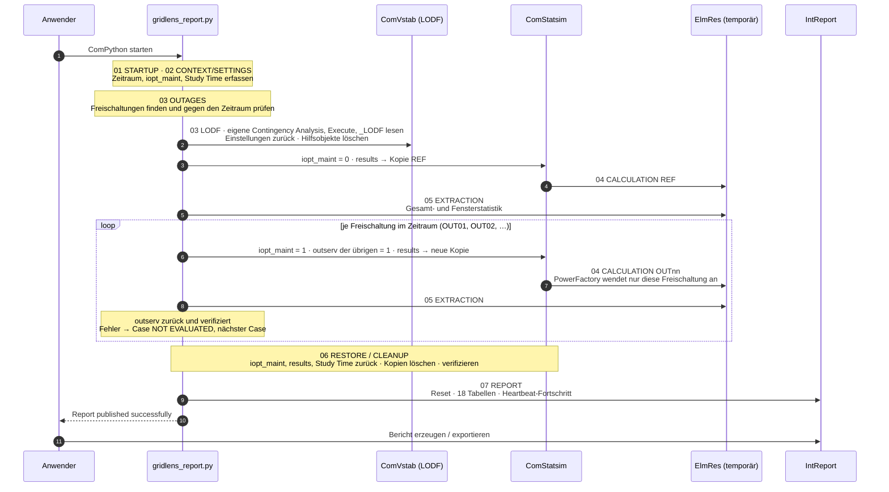
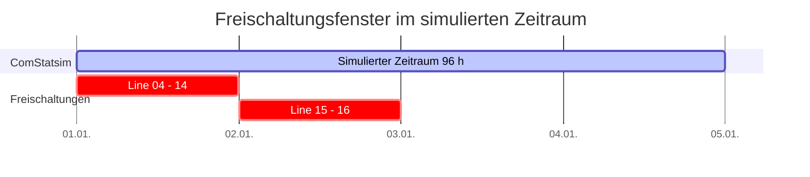
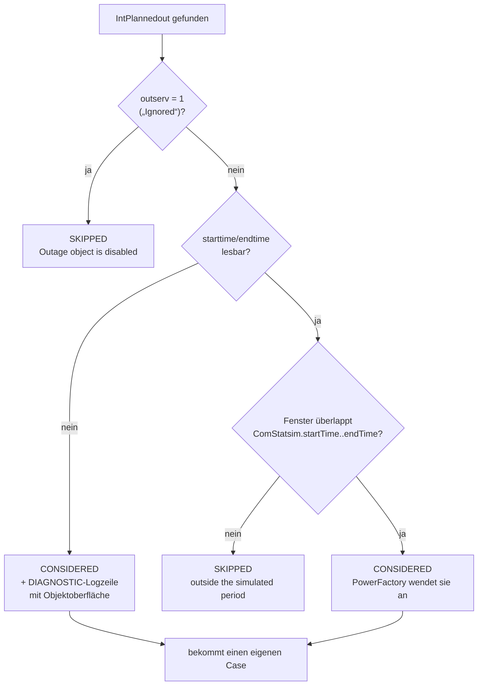
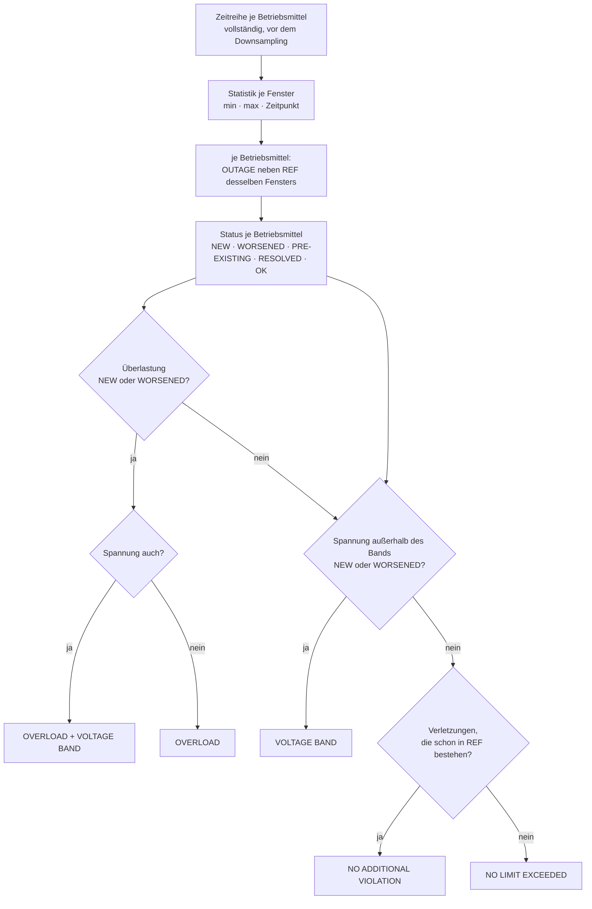
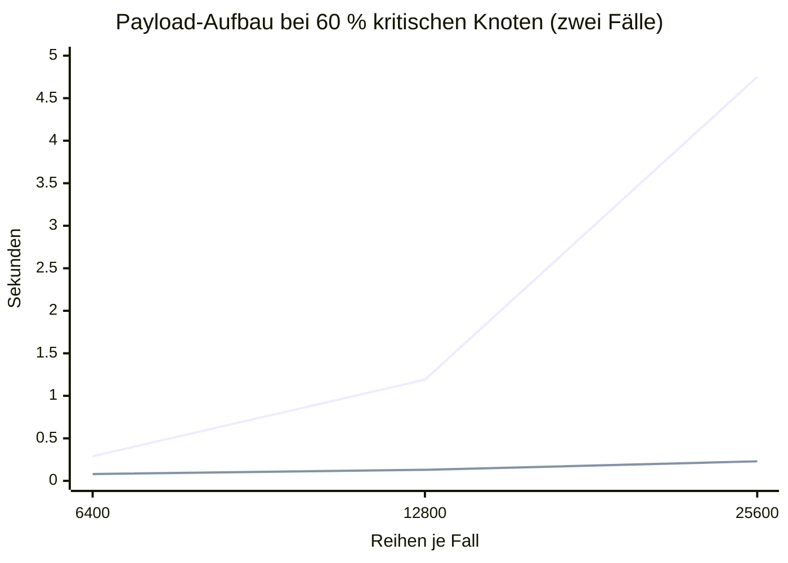

# GridLens – Big Picture

Stand: **6. Oktober 2026** · Publisher `7.0.0` · MRT `5.0.0` · Datenvertrag `5.0`

GridLens erzeugt in DIgSILENT PowerFactory 2026 einen Bericht zur technischen
Vorprüfung geplanter Außerbetriebnahmen (Freischaltungen). Ein Klick auf das
ComPython rechnet das Netz einmal ohne Freischaltungen (`REF`) und danach
**jede Freischaltung als eigenen Case**, bewertet jeden Case gegen `REF` in
seinem Zeitfenster, ergänzt die LODF aus PowerFactory und füllt die Tabellen,
aus denen PowerFactory den Bericht im Layout des Templates
`GridLens_Template_Optimiert_v2.pdf` rendert.

Der Bericht ist eine technische Vorprüfung. Er ist keine betriebliche Freigabe
und kein Nachweis für N-1-Sicherheit, Schutzkoordination,
Versorgungssicherheit oder sichere elektrische Trennung.

Dieses Dokument erklärt das Zusammenspiel. Die Betriebsanleitung steht in
[`powerfactory/README.md`](powerfactory/README.md), die verbindlichen Regeln
für Änderungen in [`AGENTS.md`](AGENTS.md).

---

## 1. Überblick

```mermaid
flowchart LR
    subgraph PF["PowerFactory 2026 – aktives Projekt"]
        SC["Study Case"]
        QDS["ComStatsim<br/>Zeitraum · Schrittweite · Profile"]
        OUT["Operational Library<br/>IntPlannedout"]
        RES["ElmRes<br/>Variablenauswahl"]
        REP["IntReport"]
        DB[("interne<br/>Reporting-DB")]
    end

    PY["gridlens_report.py<br/>ComPython unter dem IntReport"]
    MRT["MASTER_GRIDLENS.mrt<br/>Stimulsoft-Vorlage"]
    PDF["Bericht / PDF"]

    SC --> QDS
    QDS -- "rechnet REF und OUTAGE" --> PY
    OUT -- "Zeitfenster · Betriebsmittel" --> PY
    RES -- "Vorlage für temporäre Kopien" --> PY
    PY -- "CreateTable · CreateField · SetValue<br/>20 Tabellen" --> REP
    REP --> DB
    DB -- "20 Scripted*-Datenquellen" --> MRT
    MRT --> PDF
```

Ausgeliefert werden **genau zwei Dateien**, immer aus demselben Release:

| Datei | Aufgabe |
|---|---|
| `powerfactory/gridlens_report.py` | Rechnen, Auswerten, Zustand wiederherstellen, Tabellen publizieren. Nur Standardbibliothek und `powerfactory`. |
| `powerfactory/MASTER_GRIDLENS.mrt` | Berichtslayout mit 20 Datenquellen, Logos, Lesezeichen, Inhaltsverzeichnis. |

Zwei Dinge liegen bewusst **außerhalb** der Auslieferung:

- `tools/probe_planned_outages.py` – Read-only-Diagnose für offene
  PowerFactory-Fragen. Siehe Kapitel 8.
- `tests/` – lokale Prüfung, unter anderem der feldgenaue Abgleich zwischen
  Python-Tabellen und MRT-Datenquellen.

Das Skript startet **nicht** selbst das Rendern der Vorlage. Es publiziert die
Tabellen; das Erzeugen des Berichts bleibt ein eigener Schritt in PowerFactory.
So kann ein Fehler bei der Ausgabe keine validierte Berechnung überschreiben.

---

## 2. Ablauf eines Laufs

Die Schrittnummern entsprechen den Logzeilen `[GridLens][NN/7]`.

```mermaid
sequenceDiagram
    autonumber
    participant U as Anwender
    participant GL as gridlens_report.py
    participant V as ComVstab (LODF)
    participant Q as ComStatsim
    participant E as ElmRes (temporär)
    participant R as IntReport

    U->>GL: ComPython starten
    Note over GL: 01 STARTUP · 02 CONTEXT/SETTINGS<br/>Zeitraum, iopt_maint, Study Time erfassen
    Note over GL: 03 OUTAGES<br/>Freischaltungen finden und gegen den Zeitraum prüfen
    GL->>V: 03 LODF · eigene Contingency Analysis, Execute, _LODF lesen<br/>Einstellungen zurück · Hilfsobjekte löschen

    GL->>Q: iopt_maint = 0 · results → Kopie REF
    Q->>E: 04 CALCULATION REF
    GL->>E: 05 EXTRACTION<br/>Gesamt- und Fensterstatistik

    loop je Freischaltung im Zeitraum (OUT01, OUT02, …)
        GL->>Q: iopt_maint = 1 · outserv der übrigen = 1 · results → neue Kopie
        Q->>E: 04 CALCULATION OUTnn<br/>PowerFactory wendet nur diese Freischaltung an
        GL->>E: 05 EXTRACTION
        Note over GL: outserv zurück und verifiziert<br/>Fehler → Case NOT EVALUATED, nächster Case
    end

    Note over GL,Q: 06 RESTORE / CLEANUP<br/>iopt_maint, results, Study Time zurück · Kopien löschen · verifizieren
    GL->>R: 07 REPORT<br/>Reset · 18 Tabellen · Heartbeat-Fortschritt
    GL-->>U: Report published successfully
    U->>R: Bericht erzeugen / exportieren
```

Kein Lauf erzeugt Operation Scenarios, Network Variations oder weitere Study
Cases. Gibt es keine Freischaltung im Zeitraum, entfallen die Outage-Cases; der
Bericht wird trotzdem mit QA- und Freischaltungsstatus publiziert. Die Läufe
folgen einander, die Laufzeit wächst mit der Zahl der Freischaltungen.

---

## 3. Wie Freischaltungen wirken

In PowerFactory 2026 ist `IntPlannedout` ein **reines Datenobjekt**. Es hat
kein `Apply`, `Reset` oder `Check`. GridLens schaltet deshalb nichts selbst.
Es setzt am `ComStatsim` die Option `iopt_maint`, die PowerFactory mit
„Planned Outages“ beschriftet, und PowerFactory wendet jede Freischaltung
während der Rechnung **in ihrem eigenen Zeitfenster** an. Damit je Case nur eine
wirkt, setzt GridLens das `outserv` („Ignored“) aller übrigen auf 1 und stellt
es danach zurück.

Das ist genauer als pauschales Schalten. Beispiel aus dem Abnahmeprojekt
„39 Bus New England System“:

```mermaid
gantt
    title Freischaltungsfenster im simulierten Zeitraum
    dateFormat YYYY-MM-DD HH:mm
    axisFormat %d.%m.
    tickInterval 1day

    section ComStatsim
    Simulierter Zeitraum 96 h :active, p, 2014-01-01 00:00, 2014-01-05 00:00

    section Freischaltungen
    Line 04 - 14 :crit, o1, 2014-01-01 00:00, 2014-01-01 23:59
    Line 15 - 16 :crit, o2, 2014-01-02 00:00, 2014-01-02 23:59
```

Die Freischaltung „Line 04 - 14“ schaltet `Line 08 - 09` und `Line 09 - 39`.
Eine dritte Freischaltung im März läge außerhalb des Zeitraums und würde als
`SKIPPED` geführt, ohne gerechnet zu werden.

Im Case „Line 04 - 14“ fehlen `Line 08 - 09` und `Line 09 - 39` nur am 01.01.,
im Case „Line 15 - 16“ fehlt `Line 15 - 16` nur am 02.01. Am 03. und 04.01. sind
`REF` und die Cases identisch. Der Name einer Freischaltung ist Freitext – welche Betriebsmittel
sie schaltet, steht ausschließlich in `components`.

Vor der ersten Rechnung ordnet GridLens jede Freischaltung ein:

```mermaid
flowchart TD
    A["IntPlannedout gefunden"] --> B{"outserv = 1<br/>(„Ignored“)?"}
    B -- ja --> S1["SKIPPED<br/>Outage object is disabled"]
    B -- nein --> C{"starttime/endtime<br/>lesbar?"}
    C -- nein --> D["CONSIDERED<br/>+ DIAGNOSTIC-Logzeile<br/>mit Objektoberfläche"]
    C -- ja --> E{"Fenster überlappt<br/>ComStatsim.startTime..endTime?"}
    E -- nein --> S2["SKIPPED<br/>outside the simulated period"]
    E -- ja --> F["CONSIDERED<br/>PowerFactory wendet sie an"]
    D --> G["bekommt einen eigenen Case"]
    F --> G
```

Weil der Zeitraum am `ComStatsim` steht, geschieht diese Einordnung **vor**
jedem Rechenlauf. Daraus entstehen auch die Zeitfenster, die die Extraktion
für die Bewertung braucht.

---

## 4. Bewertung je Zeitfenster

Die Tabelle **Calculated Cases and Planned Outages** (Kapitel 4 des Berichts) ist die
Bewertungsgrundlage. Jede Zeile beurteilt **nur ihr eigenes Zeitfenster** und
ihren eigenen Case. Eine Statistik über den ganzen Zeitraum wäre für alle
Freischaltungen dieselbe und könnte sie nicht unterscheiden. Die Tabellen mit
gemeinsamer REF-Spalte (Zählungen, Radar, Top 10 je Case, Anhänge) zeigen dagegen die
Maxima des ganzen Zeitraums, wie im Template.

```mermaid
flowchart TD
    X["Zeitreihe je Betriebsmittel<br/>vollständig, vor dem Downsampling"] --> W["Statistik je Fenster<br/>min · max · Zeitpunkt"]
    W --> P["je Betriebsmittel:<br/>OUTAGE neben REF desselben Fensters"]
    P --> S["Status je Betriebsmittel<br/>NEW · WORSENED · PRE-EXISTING · RESOLVED · OK"]

    S --> Q1{"Überlastung<br/>NEW oder WORSENED?"}
    S --> Q2{"Spannung außerhalb des Bands<br/>NEW oder WORSENED?"}

    Q1 -- ja --> Q3{"Spannung auch?"}
    Q3 -- ja --> A3["OVERLOAD + VOLTAGE BAND"]
    Q3 -- nein --> A1["OVERLOAD"]
    Q1 -- nein --> Q2
    Q2 -- ja --> A2["VOLTAGE BAND"]
    Q2 -- nein --> Q4{"Verletzungen,<br/>die schon in REF bestehen?"}
    Q4 -- ja --> A4["NO ADDITIONAL VIOLATION"]
    Q4 -- nein --> A0["NO LIMIT EXCEEDED"]
```

Das Spannungsband richtet sich nach der Nennspannung des Knotens
(`VOLTAGE_LIMITS_KV`, z. B. 360–420 kV im 380-kV-Netz), nicht nach einem
pauschalen 0.95–1.05 p.u.

Zusätzlich gibt es `NOT SIMULATED` (übersprungen, Grund in der letzten Spalte)
und `NO RESULT DATA IN WINDOW` (keine Ergebniszeile fällt ins Fenster).

Werte genau auf dem Grenzwert sind keine Verletzung. Verursachte Verletzungen
sind rot hervorgehoben, Verletzungen, die schon in REF bestehen, gelb.

Die Tabelle hat sechs Spalten über 17 cm. Illustrative Zeile mit den Fenstern
des Abnahmeprojekts und synthetischen Messwerten:

| Planned outage | Period | Prio | Equipment out of service | Assessment | Worst values inside the window |
|---|---|---|---|---|---|
| Line 04 - 14 | 2014-01-01 00:00 - 23:59 | 1 | Line 08 - 09, Line 09 - 39 | **OVERLOAD** | Loading max 111.0 % on Line 08 - 09 at 2014-01-01 03:00 (REF 74.0 %); 1 overload: 1 new. Voltage 1.000 to 1.000 p.u.; no node outside the band. |

Der **Referenzwert** ist der Kausalitätsnachweis. Liegt er bereits über
100 %, war das Netz schon ohne Freischaltung zu eng – die Überlastung ist dann
nicht der Freischaltung anzulasten, und das Urteil lautet
`NO ADDITIONAL VIOLATION`.

---

## 5. Zustand verändern und zurücksetzen

GridLens verändert während eines Laufs genau fünf Dinge und stellt alle
wieder her, bevor irgendetwas publiziert wird. Ein nicht verifizierter Restore
ist ein harter Fehler.

```mermaid
stateDiagram-v2
    [*] --> Erfasst: Ausgangszustand lesen
    Erfasst --> Verändert: Lauf beginnt
    state Verändert {
        state "iopt_maint = 0 bzw. 1" as Option
        state "results → temporäre ElmRes" as Bindung
        state "Study Time läuft durch den QDS-Zeitraum" as Uhr
        [*] --> Option
        Option --> Bindung
        Bindung --> Uhr
    }
    Verändert --> Restore: Ende oder Fehler (finally)
    state Restore {
        state "Study Time zurück" as R1
        state "iopt_maint zurück" as R2
        state "results zurück" as R3
        state "temporäre ElmRes löschen" as R4
        [*] --> R1
        R1 --> R2
        R2 --> R3
        R3 --> R4
    }
    Restore --> Publizieren: alles verifiziert
    Restore --> Fehler: etwas nicht verifiziert
    Publizieren --> [*]: 18 Tabellen im IntReport
    Fehler --> [*]: nichts publiziert · manuelle Prüfung
```

| Was | Während des Laufs | Danach |
|---|---|---|
| `ComStatsim.iopt_maint` | `0` für REF, `1` für jeden Outage-Case | Ausgangswert, verifiziert |
| `IntPlannedout.outserv` | je Case `1` an allen außer der geprüften | Ausgangswert, verifiziert (`StateGuard`) |
| `ComVstab` (LODF) | `pComSimoutage`, `isContSens`, `calcLodf`, `lodflim` | Ausgangswerte; angelegte Contingency-Objekte gelöscht |
| `ComStatsim.results` | temporäre Kopie `GridLens_TMP_…` | ursprüngliches `ElmRes`, verifiziert |
| Study Time (`SetTime.cDate/cTime`) | läuft durch den QDS-Zeitraum | Ausgangswert, verifiziert |
| temporäre `ElmRes` | je Fall eine Kopie | gelöscht |

Alle anderen `ComStatsim`-Einstellungen bleiben unberührt. Wird ein Lauf hart
abgebrochen, bevor der Restore greift, kann `ComStatsim.results` auf einer
temporären Kopie `GridLens_TMP_…` stehen bleiben. Der nächste Lauf rechnet
trotzdem mit den hinterlegten Einstellungen: Die Kopie enthält die vollständige
Variablenauswahl, und jeder Fall wird frisch in eine neue Kopie gerechnet.
GridLens meldet das als Warnung, stellt die Bindung danach wieder her und
löscht das Objekt nicht. Aufräumen heißt hier umbenennen, nicht löschen.

---

## 6. Vom Datenvertrag zum Bericht

Python publiziert 18 Tabellen. PowerFactory stellt jedem Namen `Scripted`
voran. Die Namen, Felder und Typen müssen exakt mit den Datenquellen der MRT
übereinstimmen – `tests/test_mrt.py` und der Emissionstest in
`tests/test_gridlens_report.py` prüfen das feldgenau, auch jeden Ausdruck und
jede SQL-Abfrage der MRT. Die MRT selbst erzeugt `tools/build_mrt.py` aus
`TABLES` und den Seitenbausteinen.

| Berichtsseite | Datenquelle(n) |
|---|---|
| Titelseite, Inhaltsverzeichnis | `ReportMeta` |
| Model Quality Assurance | `ModelQuality` |
| Calculated Cases and Planned Outages | `Cases` (eine Zeile je Case) |
| Reference Case – Base State | `PieLines`, `PieTransformers`, `ReferenceExceeded` |
| Metric View | `CaseMetrics`, `Kpis` |
| Case Comparison | `CaseCounts` (drei Linienplots) |
| Radar Comparison | `Radar` (Diagramm), `CaseCounts` (Tabelle) |
| Top 10 Maximum Loaded Lines | `LineLoadingBars` |
| Most Loaded Line / Largest Delta | `TrendMostLoaded`, `TrendLargestDelta` |
| Line Impact Ranking | `LodfRanking` (je Case nach \|LODF\|, mit gemessenem Delta) |
| Top 10 Strongly Loaded Lines by Case | `TopLinesByCase` |
| Appendix A / B / C | `AppendixLine`, `AppendixTransformer`, `AppendixVoltage` |

**Case-Spalten.** Tabellen mit einer Spalte je Case (`TopLinesByCase`, `Appendix*`)
tragen `block`, `col_count` und die Spaltenköpfe `h1_name…h6_name` in jeder Zeile.
Mehr als sechs Cases laufen in einen zweiten Block. Die MRT enthält je Spaltenzahl
(6…0) ein Paar aus Gruppenkopf und Datenband, das auf `col_count` filtert, damit
keine leeren Spalten stehen. Diagramme mit einer Serie je Case (Radar, Zeitplots)
gibt es ebenso je Anzahl gezeichneter Cases (`ReportMeta.chart_cases`, 1 bis 7).

Jedes Diagramm liest eine **eigene** Tabelle. Bis 5.1.3 hingen die vier
Zeitreihen an einer Master-Detail-Relation `Plots → PlotData`. Die
PowerFactory-Berichtsengine wendet solche Relationen auf Diagramme nicht an und
hat die Punkte aller vier Plots in ein Diagramm gezeichnet. Seit 5.2.0 gibt es
keine Relation mehr, und `tests/test_mrt.py` verhindert, dass wieder eine eingeführt
wird.

Die Zeitreihen zeigen dieselben Werte wie PowerFactory, aber als Linie zwischen
den Zeitpunkten. PowerFactory zeichnet QDS-Ergebnisse als Treppe. Bis 200 Zeitpunkte
werden alle Werte geplottet; REF und alle Cases haben immer dieselben Zeitpunkte.
REF ist grau, die Cases haben feste Farben (nur zur Unterscheidung).

## LODF

Die LODF stammt aus PowerFactorys *Sensitivities / Distribution Factors*
(`ComVstab`), nicht aus eigener Rechnung. Sie wird einmal vor dem ersten Lauf
berechnet, weil sie nur von der Topologie abhängt. Das Line Impact Ranking
zeigt je Freischaltung die zehn Leitungen mit dem größten |LODF|, daneben das
gemessene Delta. Fehlt die LODF, steht der Grund im Bericht und das Ranking
fällt beschriftet auf die gemessene Laständerung zurück. Details und Grenzen
stehen in `powerfactory/README.md`; Vorbild ist `nahriva-grid-analysis`
(`docs/LODF.md`).

## Vorlagen lokal prüfen

Die MRT wird nicht von Hand bearbeitet, sondern mit `python3 tools/build_mrt.py`
erzeugt. Sie wird vor der Auslieferung mit
`Stimulsoft.Reports.Engine.NetCore` 2025.3.5 geladen und gerendert, derselben
Version, die PowerFactory 2026 SP1 mitbringt. Ohne Lizenz rendert die Engine
nur die erste Seite vollständig; einzelne Abschnitte werden deshalb gezielt als
erste Seite gerendert. Zwei Befunde stammen aus dieser Prüfung und wären ohne
sie erst in PowerFactory aufgefallen: eine leere Komponentenliste, die den
Designer abstürzen ließ, und REF/OUTAGE-Reihen mit verschiedenen Zeitpunkten.
Auf dem Mac fehlt die Schrift Segoe UI; Achsentitel verlieren dort ihr letztes
Zeichen, in PowerFactory nicht.

Jede Änderung an Feldern erfordert gleichzeitig Code, MRT, Versionsnummern und
Tests. Die Vorlage bindet ausschließlich über Platzhalter; Statuswerte wie
`CONSIDERED` oder `OVERLOAD` sind nirgends fest eingetragen.

---

## 7. Große Netze

Das Skript wurde an einem Netz mit **229 325 Ergebnisreihen** (Study Case
„Europe“) gemessen. Die Laufzeit verteilt sich so:

| Phase | Beobachtet | Ursache / Stand |
|---|---|---|
| QDS-Rechnung REF | 51 s | PowerFactory selbst |
| Extraktion REF | 90 s | `GetColumnValues` ist im Zielbuild nicht nutzbar, daher ein API-Aufruf je Zelle |
| Payload-Aufbau | hing | **behoben in 5.1.2**, siehe unten |
| Publikation | – | Heartbeat-Meldungen je Tabelle |

Der Hänger lag im Aufbau der Anhangstatistik: Für jedes kritische Element
wurde das zugehörige Objekt durch lineares Durchsuchen aller Elemente seiner
Kategorie gesucht, einmal pro Fall. Bei vielen Knoten außerhalb des
Spannungsbands wuchs das quadratisch. Seit 5.1.2 gibt es einen Index je Fall;
gemessen an einem synthetischen Modell derselben Größe mit zwei Fällen und
60 % kritischen Knoten dauert der Aufbau 2,8 s und wächst linear.

```mermaid
xychart-beta
    title "Payload-Aufbau bei 60 % kritischen Knoten (zwei Fälle)"
    x-axis "Reihen je Fall" [6400, 12800, 25600]
    y-axis "Sekunden" 0 --> 5
    line [0.29, 1.19, 4.75]
    line [0.08, 0.13, 0.23]
```

Obere Linie: bis 5.1.1, vervierfacht sich je Verdopplung. Untere Linie: ab
5.1.2.

Grenzen, die bei großen Netzen greifen:

| Konstante | Wert | Wirkung |
|---|---|---|
| `MAX_RESULT_ROWS` | 35 040 | Zeitpunkte je `ElmRes` |
| `MAX_RESULT_CELLS` | 20 000 000 | Zellen je Fall |
| `MAX_RUN_CELLS` | 120 000 000 | Zellen über alle Fälle |
| `MAX_TABLE_ROWS` | 5 000 | Zeilen je publizierter Tabelle; Überschreitung wird als `FAIL` in Model Quality gemeldet |
| `MAX_PLOT_POINTS` | 61 | Punkte je Zeitreihendiagramm |

---

## 8. Was wir über die PowerFactory-2026-API wissen

Diese Fakten wurden im Zielbuild direkt an den Objekten abgefragt – mit
`tools/probe_planned_outages.py`, nicht aus Dokumentation geschlossen.

| Objekt / Attribut | Befund |
|---|---|
| `ComStatsim.iopt_maint` | Beschriftung „Planned Outages“ – der Schalter. Im Feld bestätigt: REF und OUTAGE unterscheiden sich. |
| `ComStatsim.ciopt_maint` | berechnetes Verfügbarkeitsflag, **nicht** der Schalter |
| `ComStatsim.iopt_action`, `iopt_rep` | „Planned Outages: Processing Actions“ bzw. „Output“; von GridLens nicht verändert |
| `ComStatsim.startTime`, `endTime` | simulierter Zeitraum, Epoch-Sekunden |
| `IntPlannedout` | reines Datenobjekt; **kein** `Apply`, `Reset`, `Check`, `IsInStudyTime` |
| `IntPlannedout.starttime`, `endtime` | Epoch-Sekunden |
| `IntPlannedout.components` | die geschalteten Betriebsmittel („Components“) |
| `IntPlannedout.outserv` | „Ignored“; ab 7.0.0 von GridLens je Case zeitweise gesetzt – Wirkung noch nicht im Zielbuild geprüft |
| `SetTime.cDate`, `cTime` | **Strings**, Format `YYYYMMDD` und `HHMMSS` |
| implizite QDS-Zeitskala (`ElmRes`, Spalte −1) | Einheit `s`, aber **absolute** Epoch-Sekunden |
| `DataObject.GetAttributes()` | wirft; Attributnamen kommen über `dir()` |
| `GetAttributeDescription(name)` | liefert PowerFactorys eigene Beschriftung – der sicherste Weg, eine Option zu identifizieren |

Arbeitsweise bei neuen Fragen: erst die Probe erweitern und einen Lauf im
Zielbuild machen, dann bauen. Raten hat in diesem Projekt zweimal zu Code
geführt, der auf nicht existierende Methoden setzte.

---

## 9. Offene Punkte

- **Fachliche Sichtprüfung des PDF** am Abnahmeprojekt: Hängen die Deltas an
  den Betriebsmitteln aus `components` und nur in deren Fenstern?
- **Einzel-Cases und LODF in PowerFactory** (seit 7.0.0): Wirkt `outserv=1` an einer
  `IntPlannedout` bei gesetztem `iopt_maint`? Läuft der LODF-Ablauf im Bericht
  Ende-zu-Ende? Wie lang dauern 1+N Läufe?
- **Rendern der Variantenbänder** der MRT in PowerFactory (Querformat, Gruppenköpfe).
- **Extraktionsdauer bei großen Netzen**: 90 s für 229 325 Reihen und drei
  Zeitpunkte, weil jede Zelle einzeln gelesen wird. Ob `GetColumnValues` mit
  einem `IntVec`-Argument im Zielbuild schneller ist, ist eine Frage für die
  Probe.
- **Anhangtabellen bei großen Netzen**: Werden mehr als 5 000 Zeilen erzeugt,
  wird abgeschnitten – derzeit nach Pfad sortiert, nicht nach Schwere. Bei
  großen Netzen zeigt der Anhang damit eine beliebige Auswahl.
- **Layout der Freischaltungstabelle** mit echten, langen Betriebsmittelnamen.
- Die vollständige Abnahmematrix steht in
  [`powerfactory/README.md`](powerfactory/README.md).
