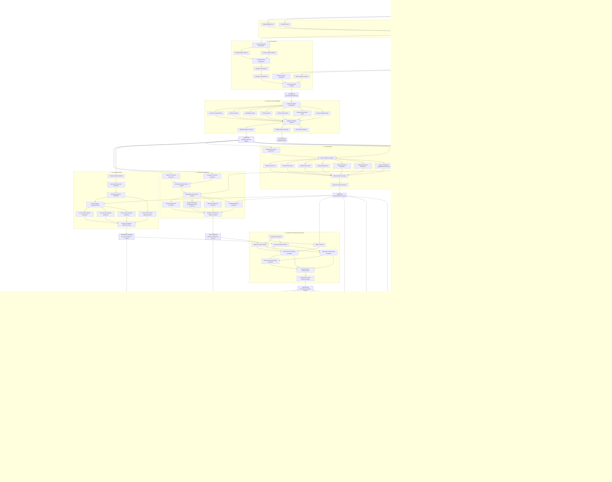

# GridLens Target Architecture

```mermaid
graph TD

%% =========================================================
%% UPSTREAM SYSTEMS
%% =========================================================

subgraph UPSTREAM["Upstream · außerhalb GridLens"]
    direction TB

    QA["Model QA Results"]
    SCEN["Scenario and Outage Metadata"]
    SIM["PowerFactory Simulation Results"]
    STUDY["Study Metadata"]
    ELEM["PowerFactory Element Metadata"]

end


%% =========================================================
%% INPUT CONTRACT
%% =========================================================

IINPUT[["I-INPUT<br/>GridLens Input Contract"]]

QA --> IINPUT
SCEN --> IINPUT
SIM --> IINPUT
STUDY --> IINPUT
ELEM --> IINPUT


%% =========================================================
%% A - INGESTION
%% =========================================================

subgraph INGEST["A · PowerFactory Ingestion"]
    direction TB

    A1["Study Metadata lesen"]
    A2["QA Results lesen"]
    A3["Scenario Metadata lesen"]
    A4["Simulation Results lesen"]
    A5["Element Metadata lesen"]

    A6["Source Provenance erfassen"]
    A7["Raw Input Dataset erzeugen"]

    A1 --> A7
    A2 --> A7
    A3 --> A7
    A4 --> A7
    A5 --> A7
    A6 --> A7

end

IINPUT --> A1
IINPUT --> A2
IINPUT --> A3
IINPUT --> A4
IINPUT --> A5


%% =========================================================
%% B - CANONICALIZATION
%% =========================================================

subgraph CANON["B · Canonicalization"]
    direction TB

    B1["Raw Input Dataset übernehmen"]

    B2["Element Identity auflösen"]
    B3["Scenario Identity auflösen"]

    B4["Variablennamen normalisieren"]
    B5["Einheiten normalisieren"]
    B6["Zeitachsen normalisieren"]

    B7["Element Registry anwenden"]
    B8["Metric Catalog anwenden"]

    B9["Canonical Dataset erzeugen"]

    B1 --> B2
    B1 --> B3

    B2 --> B4
    B3 --> B4

    B4 --> B5
    B5 --> B6

    B7 --> B9
    B8 --> B9
    B6 --> B9

end

A7 --> B1


%% =========================================================
%% CANONICAL SUPPORT MODELS
%% =========================================================

EREG[["Element Registry"]]
MCAT[["Metric and Unit Catalog"]]

EREG --> B7
MCAT --> B8


%% =========================================================
%% CANONICAL CONTRACT
%% =========================================================

ICAN[["I-CANONICAL<br/>Canonical Data Contract"]]

B9 --> ICAN


%% =========================================================
%% C - CONTRACT VALIDATION
%% =========================================================

subgraph VALID["C · Canonical Contract Validation"]
    direction TB

    C1["Canonical Dataset übernehmen"]

    C2["Scenario Coverage prüfen"]
    C3["Zeitachsen prüfen"]
    C4["Messgrößen prüfen"]
    C5["Einheiten prüfen"]
    C6["Missing Values prüfen"]
    C7["Element-Zuordnungen prüfen"]
    C8["Result Availability prüfen"]

    C9["Validation Findings sammeln"]

    C10["Validated Dataset erzeugen"]
    C11["Validation Report erzeugen"]
    C12["Run Status bestimmen"]

    C1 --> C2
    C1 --> C3
    C1 --> C4
    C1 --> C5
    C1 --> C6
    C1 --> C7
    C1 --> C8

    C2 --> C9
    C3 --> C9
    C4 --> C9
    C5 --> C9
    C6 --> C9
    C7 --> C9
    C8 --> C9

    C9 --> C10
    C9 --> C11
    C9 --> C12

end

ICAN --> C1


%% =========================================================
%% VALIDATED CONTRACT
%% =========================================================

IVAL[["I-VALIDATED<br/>Validated Canonical Dataset"]]
IVR[["I-VALIDATION<br/>Validation Report"]]

C10 --> IVAL
C11 --> IVR


%% =========================================================
%% D - DERIVED METRICS
%% =========================================================

subgraph METRICS["D · Derived Metrics"]
    direction TB

    D1["Validated Time Series übernehmen"]

    D2["Metric Definition auswählen"]

    D3["Minimum berechnen"]
    D4["Maximum berechnen"]
    D5["Mittelwert berechnen"]
    D6["Perzentile berechnen"]

    D7["Zeitpunkt Minimum bestimmen"]
    D8["Zeitpunkt Maximum bestimmen"]

    D9["weitere konfigurierte Aggregationen berechnen"]

    D10["Element Metrics erzeugen"]
    D11["Metric Provenance erfassen"]

    D1 --> D2

    D2 --> D3
    D2 --> D4
    D2 --> D5
    D2 --> D6
    D2 --> D7
    D2 --> D8
    D2 --> D9

    D3 --> D10
    D4 --> D10
    D5 --> D10
    D6 --> D10
    D7 --> D10
    D8 --> D10
    D9 --> D10

    D10 --> D11

end

IVAL --> D1
MCAT --> D2


%% =========================================================
%% DERIVED METRIC CONTRACT
%% =========================================================

IMET[["I-METRICS<br/>Derived Metrics Contract"]]

D11 --> IMET


%% =========================================================
%% E - REFERENCE COMPARISON
%% =========================================================

subgraph REF["E · Reference Comparison"]
    direction TB

    E1["Reference Scenario bestimmen"]
    E2["Comparison Scenario auswählen"]

    E3["Elemente über Element-ID matchen"]
    E4["Messgrößen über Metric-ID matchen"]

    E5["Absolute Differenzen berechnen"]
    E6["Relative Differenzen gemäß Metric Policy berechnen"]

    E7["Zeitreihen-Differenzen berechnen"]
    E8["Statistik-Differenzen berechnen"]

    E9["Reference Comparison Dataset erzeugen"]

    E1 --> E3
    E2 --> E3

    E3 --> E4

    E4 --> E5
    E4 --> E6
    E4 --> E7
    E4 --> E8

    E5 --> E9
    E6 --> E9
    E7 --> E9
    E8 --> E9

end

IVAL --> E1
IVAL --> E2
IMET --> E8
MCAT --> E4


%% =========================================================
%% F - SCENARIO COMPARISON
%% =========================================================

subgraph SCOMP["F · Scenario Comparison"]
    direction TB

    F1["Scenario Results sammeln"]

    F2["gemeinsame Elemente bestimmen"]
    F3["gemeinsame Metrics bestimmen"]

    F4["Scenario Metrics gegenüberstellen"]
    F5["Scenario Time Series gegenüberstellen"]

    F6["Cross-Scenario Minima bestimmen"]
    F7["Cross-Scenario Maxima bestimmen"]
    F8["Cross-Scenario Spread bestimmen"]

    F9["Scenario Comparison Dataset erzeugen"]

    F1 --> F2
    F2 --> F3

    F3 --> F4
    F3 --> F5

    F4 --> F6
    F4 --> F7
    F4 --> F8

    F5 --> F9
    F6 --> F9
    F7 --> F9
    F8 --> F9

end

IVAL --> F1
IMET --> F4


%% =========================================================
%% COMPARISON CONTRACTS
%% =========================================================

IREF[["I-REF-COMPARE<br/>Reference Comparison Contract"]]
ISCOMP[["I-SCENARIO-COMPARE<br/>Scenario Comparison Contract"]]

E9 --> IREF
F9 --> ISCOMP


%% =========================================================
%% G - DETERMINISTIC ORDERING & SELECTION
%% =========================================================

subgraph SELECT["G · Deterministic Ordering and Selection"]
    direction TB

    G1["Selection Rules laden"]

    G2["Metrics sortieren"]
    G3["Reference Deltas sortieren"]
    G4["Scenario Spreads sortieren"]

    G5["Elemente für Darstellung auswählen"]
    G6["Zeitpunkte für Darstellung auswählen"]
    G7["Time Series für Darstellung auswählen"]

    G8["Selection Reason dokumentieren"]

    G9["Presentation Selection Dataset erzeugen"]

    G1 --> G2
    G1 --> G3
    G1 --> G4

    G2 --> G5
    G3 --> G5
    G4 --> G5

    G3 --> G6
    G4 --> G6

    G5 --> G7
    G6 --> G7

    G5 --> G8
    G6 --> G8
    G7 --> G8

    G8 --> G9

end

IMET --> G2
IREF --> G3
ISCOMP --> G4


%% =========================================================
%% SELECTION CONTRACT
%% =========================================================

ISEL[["I-SELECTION<br/>Presentation Selection Contract"]]

G9 --> ISEL


%% =========================================================
%% H - REPORT PROJECTION
%% =========================================================

subgraph PROJ["H · Report Projection"]
    direction TB

    H1["Report Metadata erzeugen"]

    H2["QA Projection erzeugen"]
    H3["Scenario Overview erzeugen"]
    H4["Scenario Matrix erzeugen"]

    H5["Line Statistics Projection erzeugen"]
    H6["Transformer Statistics Projection erzeugen"]
    H7["Voltage Statistics Projection erzeugen"]

    H8["Reference Comparison Projection erzeugen"]
    H9["Scenario Comparison Projection erzeugen"]

    H10["Selection Tables erzeugen"]
    H11["Selected Timestamps aufbereiten"]
    H12["Plot Series erzeugen"]

    H13["Validation Information aufbereiten"]

    H14["Report Data Model zusammensetzen"]

    H1 --> H14
    H2 --> H14
    H3 --> H14
    H4 --> H14
    H5 --> H14
    H6 --> H14
    H7 --> H14
    H8 --> H14
    H9 --> H14
    H10 --> H14
    H11 --> H14
    H12 --> H14
    H13 --> H14

end

IVAL --> H2
IVAL --> H3
IVAL --> H4

IMET --> H5
IMET --> H6
IMET --> H7

IREF --> H8
ISCOMP --> H9

ISEL --> H10
ISEL --> H11
ISEL --> H12

IVR --> H13


%% =========================================================
%% I - RUN MANIFEST
%% =========================================================

subgraph MANIFEST["I · Provenance and Run Manifest"]
    direction TB

    I1["GridLens Version erfassen"]
    I2["Input Provenance erfassen"]
    I3["Schema Versions erfassen"]
    I4["Metric Catalog Version erfassen"]
    I5["Selection Rules Version erfassen"]
    I6["Source Fingerprints erfassen"]

    I7["Run Manifest erzeugen"]

    I1 --> I7
    I2 --> I7
    I3 --> I7
    I4 --> I7
    I5 --> I7
    I6 --> I7

end

A7 --> I2
MCAT --> I4
ISEL --> I5


%% =========================================================
%% REPORT CONTRACT
%% =========================================================

RDATA[["I-REPORT-DATA<br/>Stable Report Contract vN"]]

H14 --> RDATA
I7 --> RDATA


%% =========================================================
%% J - STIMULSOFT ADAPTER
%% =========================================================

subgraph STIMAD["J · Stimulsoft Adapter"]
    direction TB

    J1["Report Contract übernehmen"]

    J2["Stimulsoft DataSets erzeugen"]
    J3["Scripted Tables erzeugen"]
    J4["Scripted Fields erzeugen"]

    J5["IntReport Data Sources schreiben"]

    J6["Renderer Input erzeugen"]

    J1 --> J2
    J1 --> J3
    J1 --> J4

    J2 --> J5
    J3 --> J5
    J4 --> J5

    J5 --> J6

end

RDATA --> J1


%% =========================================================
%% RENDERER CONTRACT
%% =========================================================

IRENDER[["I-RENDER<br/>Stimulsoft Renderer Contract"]]

J6 --> IRENDER


%% =========================================================
%% TEMPLATE BUILD / RELEASE
%% =========================================================

subgraph TEMPLATE["Template Build and Release"]
    direction TB

    T1["Template Source"]

    T2["Corporate Design definieren"]
    T3["Page Structure definieren"]
    T4["Header/Footer definieren"]

    T5["Table Components definieren"]
    T6["Chart Components definieren"]

    T7["QA Chapter definieren"]
    T8["Scenario Chapter definieren"]
    T9["Comparison Chapter definieren"]
    T10["Appendix definieren"]

    T11["Master Template bauen"]
    T12["Template validieren"]

    T13["Versioniertes Master Template veröffentlichen"]

    T1 --> T2
    T1 --> T3
    T1 --> T4
    T1 --> T5
    T1 --> T6
    T1 --> T7
    T1 --> T8
    T1 --> T9
    T1 --> T10

    T2 --> T11
    T3 --> T11
    T4 --> T11
    T5 --> T11
    T6 --> T11
    T7 --> T11
    T8 --> T11
    T9 --> T11
    T10 --> T11

    T11 --> T12
    T12 --> T13

end


%% =========================================================
%% TEMPLATE CONTRACT
%% =========================================================

ITEMPL[["I-TEMPLATE<br/>Versioned Master Template Contract"]]

T13 --> ITEMPL


%% =========================================================
%% K - REPORT RENDERING
%% =========================================================

subgraph RENDER["K · Stimulsoft Rendering"]
    direction TB

    K1["Renderer Input laden"]
    K2["Master Template laden"]

    K3["Data Sources binden"]
    K4["Report rendern"]

    K5["PDF erzeugen"]

    K1 --> K3
    K2 --> K3

    K3 --> K4
    K4 --> K5

end

IRENDER --> K1
ITEMPL --> K2


%% =========================================================
%% OUTPUT
%% =========================================================

IOUT[["I-REPORT<br/>Final PDF Artifact"]]

K5 --> IOUT


%% =========================================================
%% ENGINEERING REVIEW - OUTSIDE GRIDLENS
%% =========================================================

subgraph REVIEW["Engineering Review · außerhalb GridLens"]
    direction TB

    R1["PDF öffnen"]
    R2["QA Information nachvollziehen"]
    R3["Reference State prüfen"]
    R4["Scenarios vergleichen"]

    R5["ausgewählte Betriebsmittel prüfen"]
    R6["Zeitreihen und Kennzahlen prüfen"]

    R7["fachliche Bewertung durchführen"]
    R8["Engineering Conclusion dokumentieren"]

    R1 --> R2
    R2 --> R3
    R3 --> R4
    R4 --> R5
    R5 --> R6
    R6 --> R7
    R7 --> R8

end

IOUT --> R1
```
